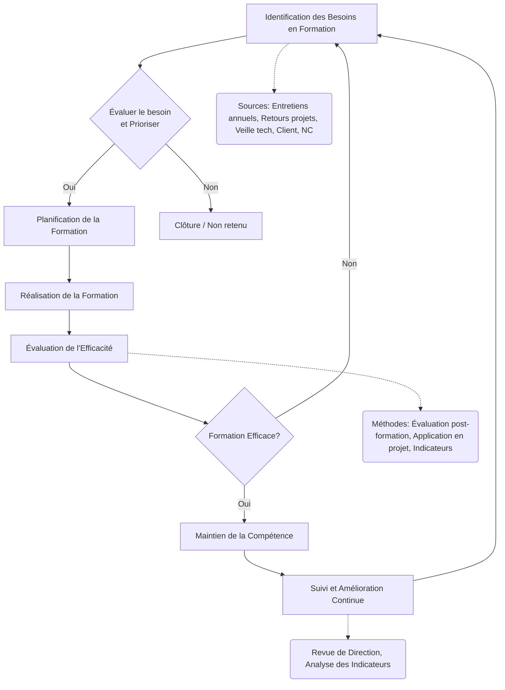

✅ Chatbot ISO avec mémoire prêt.

--- Menu ---
1. 💬 Mode Chat interactif
2. 📄 Analyse automatique d’un livrable (PDF ou TXT)
Q. ❌ Quitter

❓ Question : j ai une entreprise de developpement des app mobiles, genere moi un rapport de procedure de gestion de la formation, soyez spécifique a mon cas le maximum possible

✅ Réponse :
Absolument. En tant qu'expert en normalisation ISO 9000 et ISO 9001, et en me basant sur les principes et la structure des documents fournis, je vais générer un rapport de procédure de gestion de la formation adapté à votre entreprise de développement d'applications mobiles.

Ce rapport est conçu pour s'intégrer dans un Système de Management de la Qualité (SMQ) conforme à l'ISO 9001:2015, en mettant l'accent sur les spécificités de votre secteur d'activité.

---

# Rapport de Procédure de Gestion de la Formation pour une Entreprise de Développement d'Applications Mobiles

## 1. OBJECTIFS

La présente procédure a pour objectif de définir les dispositions à mettre en place pour identifier, planifier, réaliser, évaluer et maintenir les compétences nécessaires du personnel de l'entreprise afin de garantir la qualité du développement des applications mobiles, la satisfaction des clients et l'atteinte des objectifs stratégiques. Elle vise à s'assurer que le personnel est compétent pour réaliser les tâches qui lui sont confiées, en particulier celles liées aux technologies mobiles en constante évolution.

## 2. DOCUMENTS DE RÉFÉRENCE

*   Norme ISO 9001:2015 – Systèmes de management de la qualité – Exigences (notamment l'article 7.2 Compétences).
*   Norme ISO 9000:2015 – Systèmes de management de la qualité – Principes essentiels et vocabulaire.
*   Politique Qualité de l'entreprise.
*   Fiches de poste du personnel.

## 3. DOMAINE D'APPLICATION

Cette procédure s'applique à l'ensemble du personnel de l'entreprise dont les activités ont un impact sur la qualité des applications mobiles développées et des services associés, incluant notamment :
*   Les équipes de développement (Développeurs iOS, Android, Full-stack, etc.).
*   Les équipes de Conception UI/UX.
*   Les équipes d'Assurance Qualité (Testeurs).
*   Les Chefs de Projet.
*   Le personnel Commercial et avant-vente en contact avec les exigences techniques des clients.
*   Le personnel Support technique.

## 4. TERMINOLOGIE / DÉFINITIONS / ABRÉVIATIONS

*   **Compétence :** Capacité à appliquer des connaissances et des savoir-faire pour obtenir les résultats escomptés dans le développement d'applications mobiles (langages de programmation spécifiques, frameworks, pratiques de sécurité mobile, méthodologies Agile, etc.). (Inspiré de ISO 9000:2015)
*   **Formation :** Processus d'acquisition de compétences ou de maintien des compétences existantes.
*   **Besoins en formation :** Écart entre les compétences requises pour un poste ou un projet et les compétences actuelles du personnel.
*   **Plan de formation :** Document planifiant les actions de formation à réaliser sur une période donnée (annuelle, semestrielle).
*   **Évaluation de l'efficacité :** Mesure de l'impact de la formation sur la compétence du personnel et la performance liée au développement d'applications.
*   **RH :** Service ou personne en charge des Ressources Humaines / Gestion du personnel.
*   **PP :** Pilote de Processus (ex: Pilote du processus Développement, Pilote du processus Assurance Qualité).
*   **DG :** Direction Générale.

## 5. RESPONSABILITÉ

*   **Direction Générale (DG) :** Approuve la politique de formation et le plan de formation annuel, alloue les ressources nécessaires, suit l'efficacité globale de la formation lors de la Revue de Direction. (Inspiré de ISO 9000:2015 3.1.1)
*   **Responsable RH :** Coordonne l'identification des besoins, élabore le plan de formation, sélectionne les prestataires externes si nécessaire, gère les aspects administratifs et logistiques, maintient les enregistrements de formation.
*   **Pilotes de Processus (PP) :** Identifient les besoins en formation spécifiques à leurs processus (ex: nouvelles méthodes de test pour le PP QA, nouveau langage pour le PP Développement), évaluent l'application des compétences acquises dans leur domaine.
*   **Personnel :** Identifie ses propres besoins de développement de compétences, participe activement aux formations, applique les connaissances et savoir-faire acquis. (Inspiré de ISO 9000:2015 3.1.3 Implication)

## 6. DÉTAILS DU DOCUMENT (DESCRIPTION DES ACTIVITÉS)

### 6.1 Logigramme du Processus de Gestion de la Formation

### 6.2 Description Détaillée des Activités

| Qui ?                               | Fait Quoi ?                         | Comment ?                                                                                                                                                                                                                            | Fréquence        | R             | A           | C             | I             |
| :---------------------------------- | :---------------------------------- | :----------------------------------------------------------------------------------------------------------------------------------------------------------------------------------------------------------------------------------- | :--------------- | :------------ | :---------- | :------------ | :------------ |
| Personnel / PP / Responsable RH     | Identification des besoins          | - Entretiens individuels (annuels ou ad-hoc). - Analyse des retours d'expérience des projets (leçons apprises). - Veille technologique (nouveaux OS, frameworks, langages, outils de développement/test). - Exigences clients spécifiques. - Analyse des non-conformités liées aux compétences. - Évolutions des fiches de poste ou des processus. | Continue         | Personnel/PP  | RH          | DG            | Tous          |
| Responsable RH / PP                 | Évaluation et Priorisation          | - Collecter et consolider les besoins remontés. - Analyser la pertinence et l'urgence des besoins par rapport aux objectifs stratégiques et opérationnels (projets en cours/futurs). - Prioriser les actions de formation en fonction de leur impact potentiel et des ressources disponibles. | Au besoin / Annuelle | RH/PP         | DG          | Tous          |               |
| Responsable RH                      | Planification de la Formation       | - Élaborer le plan de formation (annuel ou périodique) détaillant les actions, objectifs, publics, prestataires, coûts et planning. - Sélectionner les modes de formation (interne, externe, e-learning, conférences, certifications...). - Soumettre le plan à la DG pour validation et allocation budgétaire. | Annuelle         | RH            | DG          | PP            |               |
| Responsable RH / Formateur (interne/externe) | Réalisation de la Formation         | - Organiser la logistique (planning, locaux, matériel). - Réaliser la formation ou coordonner l'intervention du prestataire externe. - Assurer le suivi de la participation (feuilles de présence). | Selon planning   | RH/Formateur  | PP/Personnel |               |               |
| PP / Personnel / Responsable RH     | Évaluation de l'Efficacité          | - Définir les critères d'évaluation (tests de connaissances, application en situation de travail, qualité du code produit, réduction des bugs, performance sur les projets). - Mettre en œuvre les méthodes d'évaluation (quiz, revues de code post-formation, suivi des indicateurs projet, feedback managérial). - Analyser les résultats. | Après formation / Périodique (ex: 3 mois après) | PP/Personnel  | RH          | DG            |               |
| Responsable RH / PP / Personnel     | Maintien de la Compétence           | - Encourager la pratique des compétences acquises (projets internes, sujets de recherche, participation à des communautés). - Mettre en place des sessions de partage de connaissances (présentations internes, pair programming). - Favoriser le mentorat. - Planifier des formations de rafraîchissement ou d'approfondissement si nécessaire. | Continue         | Personnel/PP  | RH          |               |               |
| Responsable RH / Direction Générale | Suivi et Amélioration Continue      | - Tenir à jour les enregistrements de formation et les fiches de compétence. - Analyser les indicateurs liés à la formation (taux de participation, résultats d'évaluation, impact sur les indicateurs qualité/projet). - Présenter un bilan formation lors de la Revue de Direction. - Identifier les opportunités d'amélioration du processus de formation lui-même. | Mensuelle / Annuelle | RH/DG         | PP          | Tous          |               |

## 7. INFORMATIONS DOCUMENTÉES À CONSERVER

Conformément aux exigences ISO 9001:2015, les informations documentées suivantes doivent être conservées :
*   Plan de formation approuvé.
*   Enregistrements des actions de formation réalisées (dates, participants, sujets).
*   Preuves de la participation (feuilles de présence, attestations).
*   Résultats des évaluations de l'efficacité de la formation.
*   Mise à jour des fiches de compétence individuelles du personnel.
*   Compte rendu de la Revue de Direction incluant le point sur la formation et les compétences.

## 8. INDICATEURS DE PERFORMANCE (Exemples)

*   **Taux de réalisation du plan de formation :** (Nombre de formations réalisées / Nombre de formations planifiées) * 100%
*   **Taux d'efficacité des formations :** (Nombre de formations jugées efficaces / Nombre total de formations évaluées) * 100% - *L'efficacité étant mesurée par l'application des compétences en situation de travail ou l'atteinte d'objectifs prédéfinis.*
*   **Pourcentage du personnel ayant les compétences requises :** (Nombre d'employés dont les compétences sont conformes aux exigences des postes / Nombre total d'employés concernés) * 100%
*   **Nombre de non-conformités liées à un manque de compétence :** Suivi des incidents ou bugs dont la cause racine est identifiée comme un manque de compétence.

---

Ce rapport fournit une structure solide pour votre procédure de gestion de la formation, spécifiquement adaptée au contexte dynamique du développement d'applications mobiles. N'hésitez pas si vous avez d'autres questions ou si vous souhaitez approfondir un aspect particulier.
